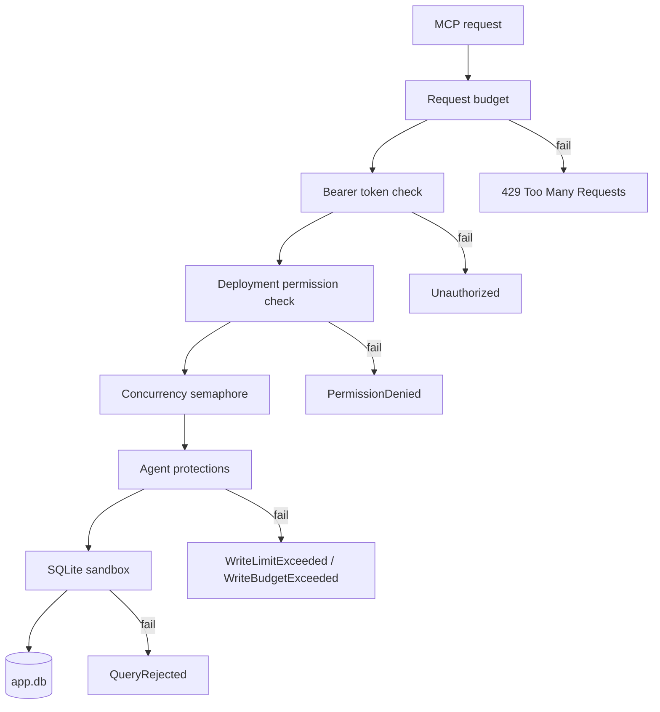

# The security model

Every layer of this model has code, `danger-raw-write` included.

**The guarantee and non-guarantee lists below are copied into the root `README.md` and
`SECURITY.md`.** Both root files are operator-facing copies of this one. When a control changes
here, change all three.

Layer detail is in [summary.md](summary.md),
[../database/sqlite-sandbox.md](../database/sqlite-sandbox.md) and
[../database/raw-writes.md](../database/raw-writes.md).

The sidecar is a security boundary between an AI agent and a live application database. It
defends against two different callers: an unauthorized client, and an authorized client that
makes a mistake. The second caller is the unusual part of this product.

## Layers

Each request passes each layer in order. A layer never becomes optional.



- **Request budget** — one fixed window for each process, before authentication. See [public-endpoint.md](public-endpoint.md).
- **Bearer token** — one token for each deployment. See [authentication.md](authentication.md).
- **Permissions** — they decide which tools exist. See [permissions.md](permissions.md).
- **Agent protections** — structured writes, mandatory predicate, mandatory `maxRows` over every changed row, bounded pre-count, row-limit rollback, server row limit, write budget, mandatory idempotency key. See [../database/structured-writes.md](../database/structured-writes.md).
- **SQLite sandbox** — authorizer, defensive mode, runtime limits, interrupt. See [sqlite-sandbox.md](../database/sqlite-sandbox.md).

The agent protections layer is the only layer that `danger-raw-write` makes weaker, and it
keeps the idempotency key and the write budget. The sandbox layer stays intact. See
[../database/raw-writes.md](../database/raw-writes.md).

## Guarantees

With the default configuration, these statements are true:

- Remote access needs authentication.
- Default permissions are read-only.
- `read` does not imply `write`.
- A write permission is not valid without `schema` and `read`.
- `write` does not accept caller-supplied write SQL.
- Structured `update` and `delete` need a predicate, and the predicate joins with `AND` only.
- Structured `update` and `delete` have a hard row limit, and a broad filter is rejected before the write starts.
- That row limit counts **every** row the write changes, so a delete cannot destroy an unbounded cascade subtree while reporting one row.
- A repeated write with the same `requestId` applies one time only.
- Repeated structured writes reach a rate limit.
- Raw writes need an explicitly dangerous permission.
- Raw writes cannot run DDL, `ATTACH` or native extension loading.
- A caller cannot supply a backup filesystem path.
- A complete backup file is always a complete database. A partial copy keeps a `.partial` suffix.
- Queries have a time limit, a result limit and a concurrency limit.
- The native SQLite defensive mechanisms are on.
- The database file never goes over the network.

State security claims as concrete controls. Do not imply that a network-exposed database is
absolutely safe.

## Non-guarantees

The MVP has **no undo**. A `delete` inside the configured limits commits, and there is no
restore tool. The operator owns the backup strategy. See
[../decisions/0001-no-undo-in-mvp.md](../decisions/0001-no-undo-in-mvp.md).

A permission applies to all tables. `write` does not protect one table from an agent that has
`write`. See
[../decisions/0002-write-is-a-whole-database-grant.md](../decisions/0002-write-is-a-whole-database-grant.md).

When an operator enables `danger-raw-write`, the token holder can run this statement:

```sql
DELETE FROM jobs;
```

This is expected behavior, not a defect. The permission deliberately bypasses the structured
write safeguards.

A stolen token receives exactly the capabilities of its deployment. The sidecar limits
capability and blast radius. It cannot make an intentionally granted destructive permission
harmless.

The write budget and the idempotency cache are per process. Two sidecar processes against one
database have two independent budgets and two independent caches.

## Related

- [permissions.md](permissions.md)
- [authentication.md](authentication.md)
- [sqlite-sandbox.md](../database/sqlite-sandbox.md)
- [threat-model.md](threat-model.md)
