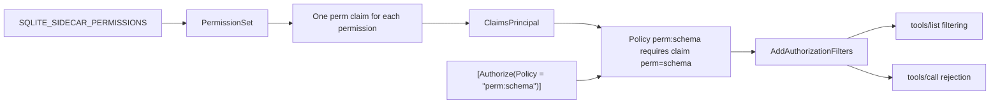

# Permissions

A permission is a property of the deployment, not of a user. One deployment has one token and one
permission set. A permission controls which MCP tools exist.

Code: `src/Xakpc.SQLiteMCPSidecar/Security/PermissionSet.cs`.

## The six permissions

```text
schema   read   write   backup   diagnostics   danger-raw-write
```

```text
SQLITE_SIDECAR_PERMISSIONS=schema,read      # the default, read-only
```

The names come from a table and not from `Enum.Parse`, because `danger-raw-write` contains a
hyphen. An unknown name fails startup: an ignored name gives a deployment with fewer tools than the
operator expects, or a false sense of restriction.

```text
SQLITE_SIDECAR_PERMISSIONS=reed
-> startup fails: "unknown permission name: reed. The known names are schema, read, ..."
```

## The read floor

**Invariant.** `write` and `danger-raw-write` are only valid together with `schema` and `read`.
`PermissionSet.ReadFloorProblems()` produces one message for each violation, and startup fails.

```text
SQLITE_SIDECAR_PERMISSIONS=write
-> startup fails: "write requires schema and read. SQLITE_SIDECAR_PERMISSIONS is missing schema and read."
```

Two reasons. A structured write validates each table name and each column name against the live
schema, thus an agent that cannot call `schema` must guess a column name. And a write-only
deployment is not a supported product shape: a caller that changes data must be able to see the
data.

The sidecar does not add the missing permissions automatically, because a silent addition makes
`SQLITE_SIDECAR_PERMISSIONS` an incorrect record of the deployment.

## The claim and policy mechanism

A permission reaches a tool as a claim, and a tool states its requirement as an attribute.



`Program.cs` registers one policy for **each permission name**, and not for each permission of this
deployment:

```csharp
foreach (var permissionName in PermissionSet.AllNames)
{
    authorization.AddPolicy(
        PermissionSet.PolicyFor(permissionName),
        policy => policy
            .AddAuthenticationSchemes(DeploymentTokenDefaults.Scheme)
            .RequireAuthenticatedUser()
            .RequireClaim(PermissionSet.ClaimType, permissionName));
}
```

The claim decides the outcome, thus the policy set needs no configuration value. This is why no
code needs `SidecarOptions` during service registration. See
[../configuration/options.md](../configuration/options.md).

## Two gating layers

`AddAuthorizationFilters()` of `ModelContextProtocol.AspNetCore` gives both layers from the one
attribute:

| Layer | Effect | Test |
| --- | --- | --- |
| Primary | A tool that the permission set does not cover is absent from `tools/list`. It does not appear and then fail. | `PermissionGatingTests.WithoutTheSchemaPermissionTheToolIsAbsentFromTheList` |
| Backstop | A direct `tools/call` of that name is rejected. A registration mistake cannot open access. | `PermissionGatingTests.WithoutTheSchemaPermissionADirectCallIsRejected` |

**Lesson.** The backstop rejection carries the message of the SDK and **not** a code of the sidecar
error model:

```text
McpProtocolException: Request failed (remote): Access forbidden: This tool requires authorization.
```

The outcome agrees with `PermissionDenied`, because the agent must stop and must not retry. The
wording is different. The MVP accepts this, because the primary layer removes the tool from the list
and an agent reaches the backstop rarely. A `AddCallToolFilter` that maps the rejection onto
`PermissionDenied` is the change if one vocabulary becomes necessary. See
[../mcp/error-model.md](../mcp/error-model.md).

## Invariants

- No permission grants another permission. `read` does not grant `write`.
- `write` and `danger-raw-write` require `schema` and `read`. Startup enforces this.
- `write` never accepts caller-supplied SQL. Only `danger-raw-write` does, through `execute_write_sql`. It still runs inside the sandbox. See [../database/raw-writes.md](../database/raw-writes.md).
- A permission applies to all tables in the database. There is no table allowlist and no column allowlist. See [../decisions/0002-write-is-a-whole-database-grant.md](../decisions/0002-write-is-a-whole-database-grant.md).
- `danger-raw-write` is independent of `write`. It is its own capability.

## Why the name `danger-raw-write`

The name is deliberately alarming. A neutral name such as `sql-write` hides the cost. An operator
must understand immediately that this permission removes the agent-safe protections. Do not change
the name.

## Documented risk levels

The README must describe risk in prose. This is documentation, not a runtime ranking.

| Permission | Risk | Reason |
| --- | --- | --- |
| `schema` | Low | Metadata only. |
| `read` | Sensitive | It can read all data in the database. |
| `write` | Higher | Constrained data modification in **all** tables. |
| `backup` | Sensitive | It can make database copies. |
| `diagnostics` | Low to moderate | Metadata and health values. |
| `danger-raw-write` | High | Arbitrary `INSERT`, `UPDATE` and `DELETE` SQL in all tables. |

## Why deployment-level permissions

The MVP has one authentication identity. With one identity there is no reason for users, roles,
groups, token ACLs or a permission database. Separate trust levels use separate deployments, which
keeps the trust boundary visible in the deployment configuration.

```text
sqlite-sidecar-readonly   token=A   permissions=schema,read
sqlite-sidecar-agent      token=B   permissions=schema,read,write,backup
sqlite-sidecar-admin      token=C   permissions=schema,read,write,backup,danger-raw-write
```

## Related

- [authentication.md](authentication.md)
- [../mcp/tool-catalog.md](../mcp/tool-catalog.md)
- [../configuration/options.md](../configuration/options.md)
