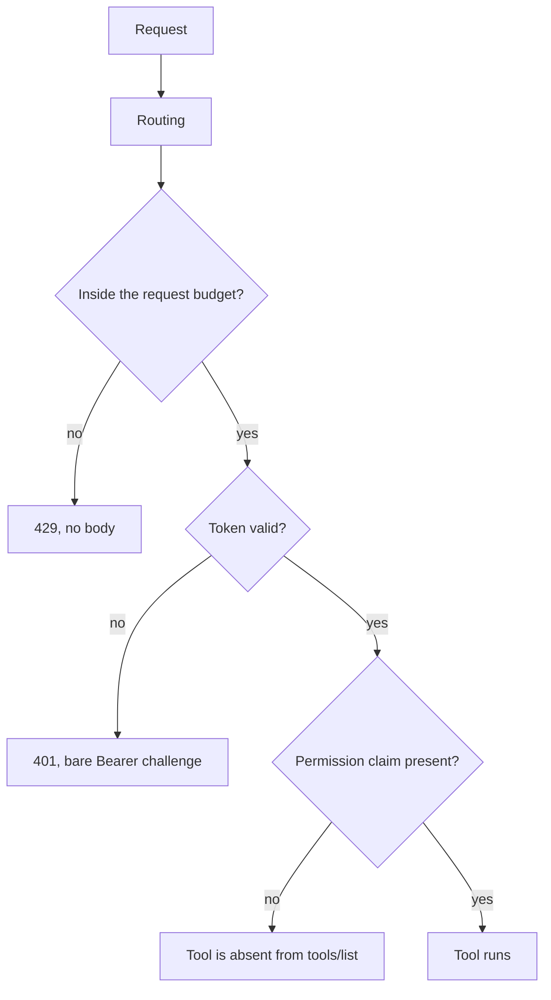

# Public endpoint

The sidecar is reachable from the public internet behind a reverse proxy. It serves two paths, it
bounds the request rate in process, and it does no host filtering.

Code: `src/Xakpc.SQLiteMCPSidecar/Mcp/SidecarEndpoints.cs`,
`src/Xakpc.SQLiteMCPSidecar/Program.cs`.

## The two paths

```csharp
public const string Mcp = "/db/mcp";
public const string Health = "/health";
```

| Path | Token | Rate limit |
| --- | --- | --- |
| `/db/mcp` | Required | Yes |
| `/health` | No | No |

**Invariant.** The MCP path is the whole public path. The sidecar routes the same URL that the agent
calls, thus no proxy rewrites the path.

A proxy that strips a prefix gives a `404` that looks like a server fault, and prefix rewriting is
the part of a proxy configuration that fails quietly. A full path in the application makes the
mistake impossible: the proxy matches the prefix `/db` and forwards the request with no change. The
platform settings are in
[../plans/design/platform-deployment.md](../plans/design/platform-deployment.md).

The stateless transport makes this safe. The server never sends its own endpoint URL to the client,
thus a path prefix cannot appear in a response. The 1.x SSE transport did send that URL. See
[../mcp/tool-catalog.md](../mcp/tool-catalog.md).

`/health` stays at the root. A platform probes the container directly and not through the proxy,
thus a prefix on this path gives nothing and it adds one more way to break a probe. The path is the
framework health endpoint, `MapHealthChecks`, with an empty check set. See
[authentication.md](authentication.md).

## The request budget

One fixed window of one minute for the whole process.

```csharp
rateLimiter.RejectionStatusCode = StatusCodes.Status429TooManyRequests;
rateLimiter.AddPolicy(SidecarEndpoints.McpRateLimitPolicy, context =>
    RateLimitPartition.GetFixedWindowLimiter(
        SidecarEndpoints.McpRateLimitPolicy,
        _ => new FixedWindowRateLimiterOptions
        {
            PermitLimit = context.RequestServices.GetRequiredService<SidecarOptions>().MaxRequestsPerMinute,
            Window = TimeSpan.FromMinutes(1),
            QueueLimit = 0,
        }));
```

`SQLITE_SIDECAR_MAX_REQUESTS_PER_MINUTE` is the one variable. The default is 120. A fixed window
needs one number only, thus the deployment gets no second knob. See
[../configuration/options.md](../configuration/options.md).

Four decisions, and each one has a reason:

| Decision | Reason |
| --- | --- |
| No partition | The deployment has one identity, thus one budget says the same thing. A partition by caller address needs `X-Forwarded-For`, which the caller controls, thus the limit becomes evadable. |
| Before authentication | Each rejected token writes a warning line. An unbounded flood of wrong tokens is therefore a log-volume attack, also with a cheap token comparison. |
| `429` and not `503` | A `503` reports a broken sidecar, and a correct agent then retries at once. |
| `QueueLimit = 0` | A queue hides the overload and it holds a connection while the agent already waits. |

## Middleware order



`app.UseRateLimiter()` is before `app.UseAuthentication()`. The order is the control, thus do not
move the call.

## What the budget does not do

- It does not make one expensive query cheap. The query timeout, `MAX_ROWS` and the request
  semaphore bound the work of one request. See
  [../database/connections.md](../database/connections.md).
- It does not separate two agents. One agent over the budget stops the other. One agent is the
  expected deployment, and a per-caller limit needs a per-caller identity. See
  [../plans/out-of-scope.md](../plans/out-of-scope.md).
- It does not apply to a second replica. Each process has its own window, like the write budget.

## No host filtering

`appsettings.json` has no `AllowedHosts` value.

**Lesson.** `WebApplication.CreateSlimBuilder` adds no host-filtering middleware and no
forwarded-headers middleware. An `AllowedHosts` key in `appsettings.json` therefore reads as a
control, and it does nothing. `ASPNETCORE_FORWARDEDHEADERS_ENABLED` also does nothing here.

The reverse proxy matches the `Host` header to select the route, thus it is the host gate. The
sidecar needs no second check: it builds no absolute URL from `Host` and it caches nothing by
`Host`.

**Condition.** Never publish the container port to the internet directly. The proxy is the only
path to the sidecar, and the host gate lives there.

## The two addresses in a rejection log

```csharp
LogRejected(
    Logger,
    Request.Path.Value ?? "/",
    Context.Connection.RemoteIpAddress?.ToString() ?? "unknown",
    Request.Headers["X-Forwarded-For"].ToString() is { Length: > 0 } forwarded ? forwarded : "none");
```

`remote` is the proxy address and it is true. `forwarded` is the address that the caller claims and
a caller can forge it. The handler reads the header itself and it adds no middleware, thus the true
address stays in `remote`. Forwarded-headers middleware would replace the true value with the
claim.

The rate limit is global, thus a forged header changes a log line only. It cannot evade the budget.

## Related

- [authentication.md](authentication.md) — the token and the identical 401
- [permissions.md](permissions.md) — what a valid token may do
- [../plans/design/platform-deployment.md](../plans/design/platform-deployment.md) — Kamal and Coolify
- [../plans/design/threat-model.md](../plans/design/threat-model.md) — the flood as an attack
