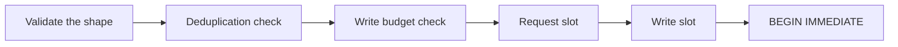

# Write controls: the budget and the idempotency cache

Current state. Both exist, and every write tool calls both through one shared path,
`SqliteTools.RunWriteAsync`. That method owns the order of the controls, thus the order cannot drift
between one write tool and another.

| Tool | `requestId` | Canonical payload |
| --- | --- | --- |
| `insert` | mandatory | the tool name, the table and the ordered values |
| `update`, `delete` | mandatory | the same, plus the filter and `maxRows` |
| `execute_write_sql` | mandatory | the tool name and the trimmed statement |
| `query`, `schema`, `diagnostics` | not used | — |
| `backup` | not used | — |

A read needs no deduplication, because a repeated read changes nothing. `backup` needs none, because
the file name carries a timestamp and a repeated backup costs disk space only. See
[../database/backups.md](../database/backups.md).

There is **one** budget counter for structured writes and raw writes. One counter is easier to explain
than two regimes, and the budget is a resource control on the database.

Code: `src/Xakpc.SQLiteMCPSidecar/Security/WriteBudget.cs`,
`src/Xakpc.SQLiteMCPSidecar/Security/WriteDeduplication.cs`.

**Invariant.** Both hold process state. They reset at a restart and two processes do not share them.
This is the reason that one sidecar serves one database. Nothing in the code enforces that rule, thus
the deployment documentation must state it.

## Order of the controls



Shape validation runs first and before the request slot: a malformed request must not occupy a slot or
reach the database.

Deduplication runs **before** the budget check. A replayed response writes no row, thus it consumes no
budget. `WriteBudgetTests.AReplayedWriteConsumesNoBudget` proves the order.

## The write budget

A broad filter is one failure mode. Many small valid writes are another.

```text
SQLITE_SIDECAR_MAX_WRITE_ROWS_PER_MINUTE   default 500
```

A rolling one-minute window over a queue of `(timestamp, rows)`.

**Invariant.** Count committed rows, never attempted rows. A write that rolled back changed nothing,
thus it must not consume the budget of a write that would succeed.
`WriteBudgetTests.ARejectedWriteConsumesNoBudget` proves it.

**Invariant.** Count `rowsChanged` and never `rowsAffected`. A row that `ON DELETE CASCADE` removed
and a row that a trigger wrote are real write volume, thus one `delete` that cascades into a thousand
rows must cost a thousand and not one. See
[../decisions/0004-maxrows-bounds-total-changes.md](../decisions/0004-maxrows-bounds-total-changes.md).

**Invariant.** `HasCapacity` is a gate and not a reservation. One write can therefore cross the cap,
because the affected row count is not known before execution. `SQLITE_SIDECAR_MAX_WRITE_ROWS` already
bounds one write, thus the overshoot is bounded and the budget throttles the **next** operation.
`SECURITY.md` must state the throttle behaviour in these words.

The timestamps come from `TimeProvider.GetTimestamp` and not from the wall clock. The window must not
open or close because an operator corrected the system time.

## The idempotency cache

Each write tool takes a mandatory `requestId`. See
[../decisions/0003-mandatory-idempotency-key.md](../decisions/0003-mandatory-idempotency-key.md).

```text
window:       5 minutes
entries:      1000, the oldest goes first
key length:   128 characters
```

Three bounds, because a dictionary with caller-supplied keys is a memory-exhaustion primitive.

| Outcome | Meaning |
| --- | --- |
| `NotFound` | New identifier. **The check reserved it.** Execute. |
| `Replay` | Identifier and payload match a committed write. Return the stored response. |
| `PayloadConflict` | Identifier matches, payload does not. `InvalidWrite`. |
| `InFlight` | The same request is running on another call. `DatabaseBusy`, "already running". |

**Invariant.** `Check` reserves the identifier inside the lock that reads it, and `NotFound` means
"you own the reservation". `RunWriteAsync` ends it with `Store` on a commit and with `Release` on
every other path, in a `finally`, thus an unexpected exception cannot leak one.

**Lesson.** A test and a separate reserve is not the same thing. `Check` and `Store` used to take
the lock separately and `Store` ran only after the commit, thus every caller that arrived before
that commit was told to execute and two concurrent calls with one identifier **both wrote the row**.
The window was the whole duration of the write, and an MCP client retrying a call that timed out
lands in it by construction: the transport is stateless, so the retry is a second live request and
not a replacement for the first. `maxRows` bounds one call; it does not bound the same call two
times. `WriteDeduplicationTests.ASecondCheckBeforeTheFirstStoreDoesNotSayExecute` is the proof and it
needs no timing.

**Lesson.** `Release` marks the entry rather than removing it. The key is already in the order
queue, thus a removal would let a later reservation enqueue the same key a second time, and eviction
would then drop a live entry while the stale duplicate sat in front of it. An entry therefore has
three states: reserved, released and committed.

**Invariant.** Store a committed outcome only. A cached failure would make the instruction "retry
later" of `DatabaseBusy` and `WriteBudgetExceeded` impossible to follow for the whole window.
`WriteIdempotencyTests.ARequestIdThatFailedStaysUsable` proves it, and a released reservation is
what makes that retry executable.

**Invariant.** A replay returns the **byte-identical** response. A retry has to look like the first
call, thus no flag marks it. The `replayed=true` field of the log line is the only record.

**Invariant.** The payload hash normalizes the request: the keys are ordered and lower-cased. The
column order of a JSON object is not significant, thus without the ordering the same request with a
different key order would read as different work and break a correct retry.
`WriteIdempotencyTests.TheKeyOrderOfTheValuesObjectDoesNotChangeTheIdentity` proves it.

**Invariant.** The order of the `where` list stays as the caller sent it. A client library reorders
the members of an object, which is why the values are sorted, but it never reorders the items of an
array.

**Invariant.** The canonical text starts with the tool name, thus one `requestId` reused across two
different tools is a `PayloadConflict` and not a replay.
`UpdateToolTests.ARequestIdFromAnInsertConflictsWithAnUpdate` proves it.

The entry holds a SHA-256 hash and never the canonical text, thus the cache holds no column value.

**Lesson.** `Trim` must discard a queue key that the dictionary no longer holds and then continue. A
`break` there stops every later trim and makes the window permanent.

## Related

- [../database/structured-writes.md](../database/structured-writes.md) — a caller of both controls
- [../database/raw-writes.md](../database/raw-writes.md) — the other caller
- [../decisions/0003-mandatory-idempotency-key.md](../decisions/0003-mandatory-idempotency-key.md)
- [../mcp/error-model.md](../mcp/error-model.md)
- [permissions.md](permissions.md)
