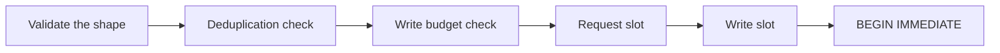

# Write controls: the budget and the idempotency cache

Current state. Both exist and `insert` calls both.

Code: `src/Xakpc.SQLiteMCPSidecar/Security/WriteBudget.cs`,
`src/Xakpc.SQLiteMCPSidecar/Security/WriteDeduplication.cs`.

**Invariant.** Both hold process state. They reset at a restart and two processes do not share them.
This is the reason that one sidecar serves one database. Nothing in the code enforces that rule, thus
the deployment documentation must state it.

## Order of the controls



Shape validation runs first and before the request slot: a malformed request must not occupy a slot or
reach the database.

Deduplication runs **before** the budget check. A replayed response writes no row, thus it consumes no
budget. `WriteBudgetTests.AReplayedWriteConsumesNoBudget` proves the order.

## The write budget

A broad filter is one failure mode. Many small valid writes are another.

```text
SQLITE_SIDECAR_MAX_WRITE_ROWS_PER_MINUTE   default 500
```

A rolling one-minute window over a queue of `(timestamp, rows)`.

**Invariant.** Count committed rows, never attempted rows. A write that rolled back changed nothing,
thus it must not consume the budget of a write that would succeed.
`WriteBudgetTests.ARejectedWriteConsumesNoBudget` proves it.

**Invariant.** `HasCapacity` is a gate and not a reservation. One write can therefore cross the cap,
because the affected row count is not known before execution. `SQLITE_SIDECAR_MAX_WRITE_ROWS` already
bounds one write, thus the overshoot is bounded and the budget throttles the **next** operation.
`SECURITY.md` must state the throttle behaviour in these words.

The timestamps come from `TimeProvider.GetTimestamp` and not from the wall clock. The window must not
open or close because an operator corrected the system time.

## The idempotency cache

Each write tool takes a mandatory `requestId`. See
[../decisions/0003-mandatory-idempotency-key.md](../decisions/0003-mandatory-idempotency-key.md).

```text
window:       5 minutes
entries:      1000, the oldest goes first
key length:   128 characters
```

Three bounds, because a dictionary with caller-supplied keys is a memory-exhaustion primitive.

| Outcome | Meaning |
| --- | --- |
| `NotFound` | New identifier. Execute. |
| `Replay` | Identifier and payload match a committed write. Return the stored response. |
| `PayloadConflict` | Identifier matches, payload does not. `InvalidWrite`. |

**Invariant.** Store a committed outcome only. A cached failure would make the instruction "retry
later" of `DatabaseBusy` and `WriteBudgetExceeded` impossible to follow for the whole window.
`WriteIdempotencyTests.ARequestIdThatFailedStaysUsable` proves it.

**Invariant.** A replay returns the **byte-identical** response. A retry has to look like the first
call, thus no flag marks it. The `replayed=true` field of the log line is the only record.

**Invariant.** The payload hash normalizes the request: the keys are ordered and lower-cased. The
column order of a JSON object is not significant, thus without the ordering the same request with a
different key order would read as different work and break a correct retry.
`WriteIdempotencyTests.TheKeyOrderOfTheValuesObjectDoesNotChangeTheIdentity` proves it.

The entry holds a SHA-256 hash and never the canonical text, thus the cache holds no column value.

**Lesson.** `Trim` must discard a queue key that the dictionary no longer holds and then continue. A
`break` there stops every later trim and makes the window permanent.

## Related

- [../database/structured-writes.md](../database/structured-writes.md) — the caller of both controls
- [../plans/design/write-idempotency.md](../plans/design/write-idempotency.md) — the remaining design
- [../mcp/error-model.md](../mcp/error-model.md)
- [permissions.md](permissions.md)
