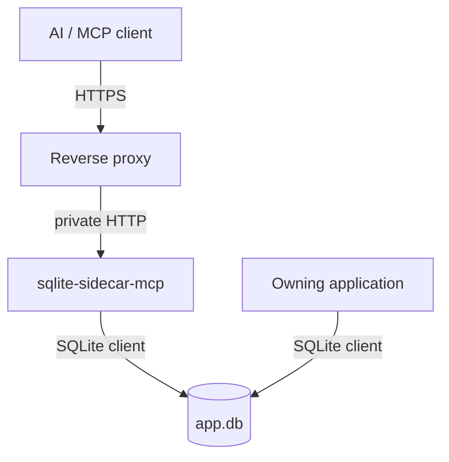

# Project summary

`sqlite-sidecar-mcp` is an agent-safe MCP sidecar for one live SQLite database. It runs next
to an application that already owns the database file. It gives remote MCP clients controlled
access to schema, read queries, bounded structured writes, backups and basic diagnostics. The
owning application does not change. The sidecar is only one more SQLite client.

The product is a security boundary between an AI agent and a production database. It must
limit the damage that an authorized but mistaken agent can cause. The implementation is C# on
.NET 10, it speaks MCP over Streamable HTTP, it returns row data as TOON, and it ships as a
Linux OCI image under Apache-2.0.

## Implementation status

**Nothing is implemented.** The repository holds the stock Visual Studio ASP.NET Core Web API
template. `src/Xakpc.SQLiteMCPSidecar/Program.cs` still serves the `WeatherForecast` sample
endpoint. `test/` is empty.

The full design is therefore a plan. It lives under [plans/](plans/), and each design file
carries a planned-status banner. Content moves out of `plans/design/` into a domain directory
when code implements it.

| Area | State |
| --- | --- |
| Design | Complete and recorded in [plans/design/](plans/design/) |
| Plan of work | [plans/mvp-roadmap.md](plans/mvp-roadmap.md) |
| Permanent decisions | [decisions/](decisions/) |
| Code | Template only |
| Tests | None |

## Repository layout

```text
Xakpc.SQLiteMCPSidecar.slnx
Directory.Build.props              # output to build/bin, build/obj
src/Xakpc.SQLiteMCPSidecar/        # the one production project
    Program.cs                     # template WeatherForecast sample
    Dockerfile                     # Visual Studio template
    appsettings.json               # AllowedHosts is "*", too wide for production
test/                              # empty
sqlite-sidecar-mcp — Design Document.md
```

The design document is the origin of this lode. The lode is now the working memory, and it
holds decisions that the design document does not have. Read the design document only for the
original wording.

## Capability split

This split is the core product idea. Keep it visible in code and in documentation.

| Permission | Meaning |
| --- | --- |
| `read` | Arbitrary caller `SELECT` SQL. |
| `write` | Structured, bounded writes. The caller sends no SQL. |
| `danger-raw-write` | Caller `INSERT` / `UPDATE` / `DELETE` SQL. |

`write` and `danger-raw-write` are only valid together with `schema` and `read`. Each
permission applies to each table in the database. See
[plans/design/permission-model.md](plans/design/permission-model.md).

## Nine tools

```text
schema   query   insert   update   delete
backup   backup_status   diagnostics   execute_write_sql
```

The permission set decides which tools exist. See
[plans/design/mcp-tool-catalog.md](plans/design/mcp-tool-catalog.md).

## Context



**Invariant.** One sidecar process serves one database. The write budget and the idempotency
cache are in process memory, thus a second replica makes both guarantees weaker without an
error message. Nothing in the code enforces this rule.

## Lode entry points

- [lode-map.md](lode-map.md) — index of each lode file.
- [terminology.md](terminology.md) — domain language.
- [practices.md](practices.md) — rules for the code we write.
- [decisions/](decisions/) — decisions that are difficult to reverse.
- [plans/mvp-roadmap.md](plans/mvp-roadmap.md) — the phased plan.
- [plans/design/security-model.md](plans/design/security-model.md) — the security model.
