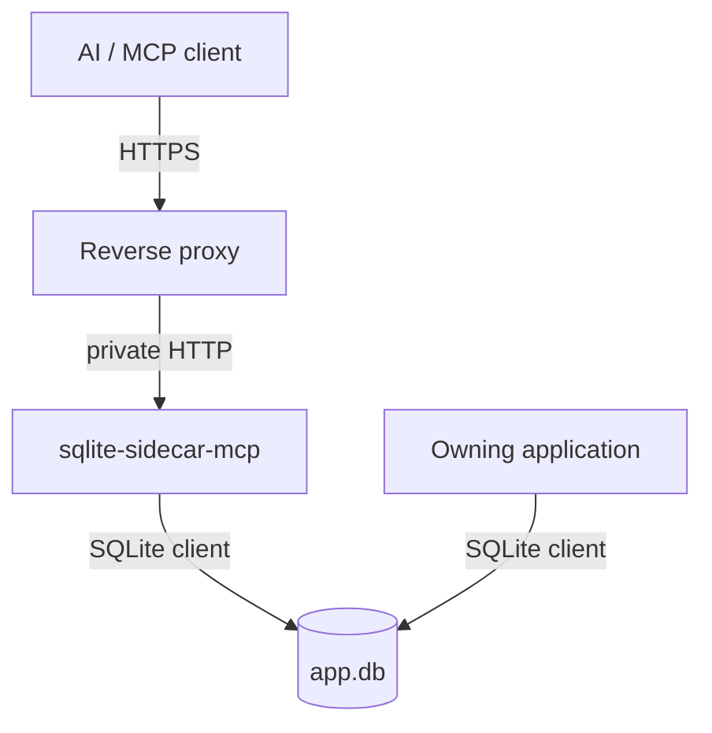

# Project summary

`sqlite-sidecar-mcp` is an agent-safe MCP sidecar for one live SQLite database. It runs next
to an application that already owns the database file. It gives remote MCP clients controlled
access to schema, read queries, bounded structured writes, backups and basic diagnostics, and, with
one explicit permission, raw DML. The owning application does not change. The sidecar is only one more
SQLite client.

The product is a security boundary between an AI agent and a production database. It must
limit the damage that an authorized but mistaken agent can cause. The implementation is C# on
.NET 10, it speaks MCP over Streamable HTTP, it returns row data as TOON, and it ships as a
Linux OCI image under Apache-2.0.

## Implementation status

The read half of the product works end to end: configuration, startup validation, token
authentication, permission gating, the stateless MCP endpoint at `/db/mcp`, the request budget, the
always-on SQLite sandbox, the `schema` and `query` tools, TOON results, and a dual-target end-to-end
test harness.

The structured write path is complete. `insert`, `update` and `delete` all exist, over the write
connection, the write semaphore, the write authorizer policy, identifier validation, the flat filter
model, the bounded pre-count, the row-limit rollback, the write budget and the idempotency cache.
`maxRows` bounds every row that a write changes, a cascade and a trigger included.

The operational half is done too. `backup` copies the live database with an incremental
`sqlite3_backup_step` loop, so the owning application keeps writing, and it abandons itself after 50
restarts. `diagnostics` reports a fixed value set.

The escape hatch exists as well. `execute_write_sql` runs one caller-written `INSERT`, `UPDATE` or
`DELETE` behind `danger-raw-write`, on the same write connection and through the same idempotency
cache and write budget, under a third authorizer policy that also refuses a write to an `sqlite_%`
object. It gives up `maxRows`, the pre-count and the rollback, and it gives up nothing of the SQLite
sandbox.

**Two end-to-end suites found four defects and all four are fixed.** One suite runs the sidecar
against a database that another client is writing; the other sends a corpus of malformed calls. The
worst was that two concurrent calls with one `requestId` both wrote, which is the failure the
idempotency key exists to prevent; `Check` now reserves the identifier in the lock that reads it. The
other three: an argument of the wrong JSON type reached the agent with no error code, an empty or
comment-only statement answered as a successful query of zero rows, and `execute_write_sql` ran a
`SELECT` and held the write lock for it. See `.scratch/agent-abuse-hardening/` and
[plans/required-tests.md](plans/required-tests.md).

**Every product capability is implemented, and the product is released.** `v0.1.1` is the current
released version, public on `ghcr.io/xakpc/sqlite-mcp-sidecar` as `0.1.1` and `latest`, on one
manifest for `linux/amd64` and `linux/arm64`. The image is non-root and hardened, CI runs the suite
against that image, and `README.md`, `SECURITY.md` and `LICENSE` exist. What is left is the NativeAOT
attempt (Phase 8). See [deployment/distribution.md](deployment/distribution.md).

| Area | State |
| --- | --- |
| Configuration and startup validation | Implemented — [configuration/options.md](configuration/options.md) |
| Authentication and the health endpoint | Implemented — [security/authentication.md](security/authentication.md) |
| Public endpoint: paths and the request budget | Implemented — [security/public-endpoint.md](security/public-endpoint.md) |
| Permissions and tool gating | Implemented — [security/permissions.md](security/permissions.md) |
| MCP endpoint and the tool catalog | Implemented — [mcp/tool-catalog.md](mcp/tool-catalog.md) |
| Read-only connection | Implemented — [database/connections.md](database/connections.md) |
| SQLite sandbox | Implemented — [database/sqlite-sandbox.md](database/sqlite-sandbox.md) |
| TOON results and limits | Implemented — [mcp/query-results.md](mcp/query-results.md) |
| Error model, every path | Implemented — [mcp/error-model.md](mcp/error-model.md) |
| Test harness | Implemented — [testing/e2e-harness.md](testing/e2e-harness.md) |
| Live-database contention suite | Implemented — [testing/live-database-suite.md](testing/live-database-suite.md) |
| Badly-behaved agent corpus | Implemented — [testing/bad-agent-suite.md](testing/bad-agent-suite.md) |
| Write connection, write semaphore, write authorizer policy | Implemented — [database/connections.md](database/connections.md), [database/sqlite-sandbox.md](database/sqlite-sandbox.md) |
| `insert` and identifier validation | Implemented — [database/structured-writes.md](database/structured-writes.md) |
| Write budget and write idempotency | Implemented — [security/write-controls.md](security/write-controls.md) |
| `update`, `delete`, the filter model, the pre-count | Implemented — [database/structured-writes.md](database/structured-writes.md) |
| Backup, the step loop and the restart cap | Implemented — [database/backups.md](database/backups.md) |
| Diagnostics | Implemented — [database/diagnostics.md](database/diagnostics.md) |
| `execute_write_sql` and the DML authorizer policy | Implemented — [database/raw-writes.md](database/raw-writes.md) |
| Container, compose and the CI container run | Implemented — [deployment/container.md](deployment/container.md) |
| The published image | Implemented — [deployment/distribution.md](deployment/distribution.md) |
| Operator documentation | Implemented — `README.md`, `SECURITY.md`, `LICENSE` |
| NativeAOT | Analyzers on. The publish attempt is Phase 8 |

**The hard boundaries are proven on Linux.** The sandbox depends on the native SQLite build, thus
the boundary list runs against the container in CI for two permission sets, once through `query` and
once through `execute_write_sql`. See [testing/e2e-harness.md](testing/e2e-harness.md).

`plans/design/` is gone. Every file that was there is current state now, under
[deployment/](deployment/) and [security/](security/).

## Repository layout

```text
Xakpc.SQLiteMCPSidecar.slnx
Directory.Build.props              # output to build/bin, build/obj
global.json                        # selects the Microsoft.Testing.Platform test runner
README.md                          # self-contained: recipes, variables and security inline
SECURITY.md                        # the security half again, where GitHub reads it
LICENSE                            # Apache-2.0
compose.yaml                       # the local run and the copy-paste example
.dockerignore                      # for the repository-root build context
.github/workflows/ci.yml           # build and test on Linux, then the suite against the image
.github/workflows/release.yml      # tag v* publishes to ghcr.io, amd64 and arm64
docs/agents/                       # agent skills: issue-tracker.md, triage-labels.md, domain.md
scripts/
    seed-dev-db.ps1                # builds build/dev/app.db, run it before the first launch
    dev-sidecar.ps1                # a live sidecar with any permission set
    token.cs                       # asks for a deployment shape, mints the token and the env block
src/Xakpc.SQLiteMCPSidecar/
    Program.cs
    mcp.http                       # manual MCP requests
    Dockerfile                     # root build context, cross-compiles to $TARGETARCH
    Properties/launchSettings.json # three project profiles and one container profile
    Configuration/                 SidecarOptions.cs, SidecarStartup.cs
    Database/                      SqliteService.cs, SqliteSecurity.cs, QueryResult.cs,
                                   StructuredWriteBuilder.cs, BackupService.cs
    Exceptions/                    SidecarConfigurationException.cs, StatementRejectedException.cs,
                                   InvalidWriteException.cs, WriteLimitExceededException.cs
    Mcp/                           SqliteTools.cs, SidecarError.cs, SidecarEndpoints.cs,
                                   ArgumentBindingFilter.cs
    Security/                      PermissionSet.cs, DeploymentTokenAuthenticationHandler.cs,
                                   WriteBudget.cs, WriteDeduplication.cs
test/Xakpc.SQLiteMCPSidecar.Tests/
    GlobalUsings.cs
    Harness/                       SidecarHarness.cs, OwningApplication.cs, BadAgentCorpus.cs
    Fixtures/                      sample-db.sql, SampleDatabase.cs, DevDatabaseTests.cs,
                                   bad-agent-corpus.json
    StartupTests.cs, AuthTests.cs, PermissionGatingTests.cs, SchemaToolTests.cs
    SandboxBoundaryTests.cs, QueryToolTests.cs, RateLimitTests.cs
    InsertToolTests.cs, UpdateToolTests.cs, DeleteToolTests.cs
    WriteIdempotencyTests.cs, WriteBudgetTests.cs, RawWriteToolTests.cs
    BackupToolTests.cs, DiagnosticsToolTests.cs
    LiveDatabaseTests.cs           the sidecar and another client on one file
    BadAgentTests.cs               the malformed-call corpus, and the raw-HTTP half
    WriteDeduplicationTests.cs     the idempotency cache on its own
.scratch/agent-abuse-hardening/    the four gaps the two suites found
sqlite-sidecar-mcp — Design Document.md
```

The design document is the origin of this lode. The lode is now the working memory, and it
holds decisions that the design document does not have. Read the design document only for the
original wording.

## Capability split

This split is the core product idea. Keep it visible in code and in documentation.

| Permission | Meaning |
| --- | --- |
| `read` | Arbitrary caller `SELECT` SQL. |
| `write` | Structured, bounded writes. The caller sends no SQL. |
| `danger-raw-write` | Caller `INSERT` / `UPDATE` / `DELETE` SQL. |

`write` and `danger-raw-write` are only valid together with `schema` and `read`. Each
permission applies to each table in the database. See
[security/permissions.md](security/permissions.md).

## Eight tools

```text
schema   query   insert   update   delete   backup   diagnostics
execute_write_sql
```

Every one of the eight exists, and `backup` is the one task-mode tool: it answers with a task
id and the client polls for the outcome. The permission set decides which tools exist. See
[mcp/tool-catalog.md](mcp/tool-catalog.md).

## Context



**Invariant.** One sidecar process serves one database. The write budget and the idempotency
cache are in process memory, thus a second replica makes both guarantees weaker without an
error message. Nothing in the code enforces this rule.

## Run it

```powershell
dotnet test --solution Xakpc.SQLiteMCPSidecar.slnx   # the whole suite

./scripts/seed-dev-db.ps1                            # one time, before the first launch
# then F5 on a launch profile, or:
./scripts/dev-sidecar.ps1                            # a live sidecar on port 8080

dotnet run scripts/token.cs                          # a real deployment token and its env block
```

Each launch profile and the script serve `http://localhost:8080/db/mcp` with the token `dev-token`,
thus `src/Xakpc.SQLiteMCPSidecar/mcp.http` calls any of them with no change.

See [testing/e2e-harness.md](testing/e2e-harness.md).

## Lode entry points

- [lode-map.md](lode-map.md) — index of each lode file.
- [terminology.md](terminology.md) — domain language.
- [practices.md](practices.md) — rules for the code we write.
- [decisions/](decisions/) — decisions that are difficult to reverse.
- [plans/mvp-roadmap.md](plans/mvp-roadmap.md) — the phased plan.
- [security/model.md](security/model.md) — the security model, and what README.md and SECURITY.md copy.
- [deployment/summary.md](deployment/summary.md) — the image, the registry and the recipes.
- [database/sqlite-sandbox.md](database/sqlite-sandbox.md) — the always-on SQLite controls.
