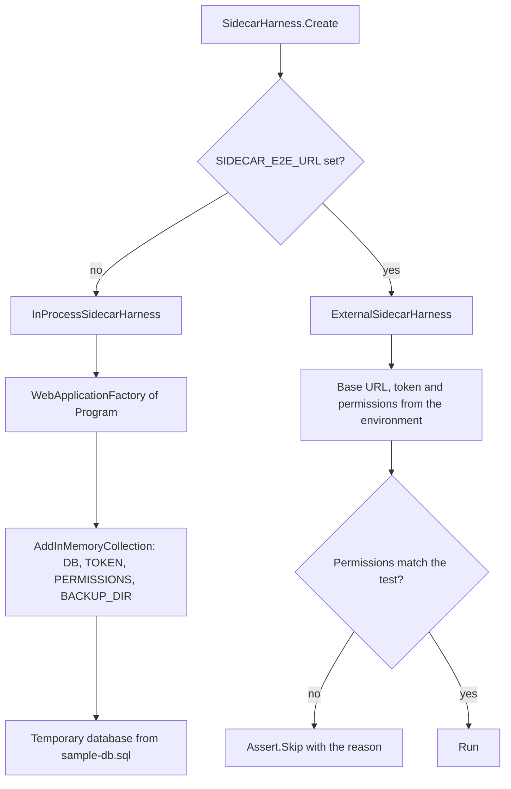

# End-to-end test harness

One test project, `test/Xakpc.SQLiteMCPSidecar.Tests`. The suite runs against the sidecar in this
process by default, and against a sidecar that already runs when three environment variables are
set. Every later phase reuses this harness, thus keep it working.

Code: `test/Xakpc.SQLiteMCPSidecar.Tests/Harness/SidecarHarness.cs`.

## Why two targets

The SQLite sandbox depends on the native SQLite build, thus a Windows developer run does not prove
the shipped behaviour. The roadmap therefore needs the functional suite against the published Linux
artifact. The external target is how a container run reuses these tests with no rewrite.



```powershell
dotnet test --solution Xakpc.SQLiteMCPSidecar.slnx     # in process

$env:SIDECAR_E2E_URL = 'http://localhost:8080'
$env:SIDECAR_E2E_TOKEN = 'dev-token'
$env:SIDECAR_E2E_PERMISSIONS = 'schema,read'
dotnet test --solution Xakpc.SQLiteMCPSidecar.slnx     # against a real process
```

**Invariant.** An external sidecar has a fixed permission set. A test that needs a different one
calls `Assert.Skip` with the reason, and it does not fail. The external target therefore reports
honestly instead of reporting a false failure.

The external target needs `SIDECAR_E2E_PERMISSIONS`, because the harness cannot learn the permission
set of a process that it did not start.

## In-memory configuration, not environment variables

```csharp
webHost.ConfigureAppConfiguration((_, configuration) => configuration.AddInMemoryCollection(settings));
```

Environment variables are process-global and would collide across parallel test classes.

**Lesson.** This is also why `SidecarOptions.Load` runs on the first resolve of the singleton and not
on `builder.Configuration`. A read before `builder.Build()` cannot see the source that the test host
adds. See [../configuration/options.md](../configuration/options.md).

## The MCP client over the test transport

```csharp
new HttpClientTransport(
    new HttpClientTransportOptions
    {
        Endpoint = new Uri(httpClient.BaseAddress!, "/mcp"),
        TransportMode = HttpTransportMode.StreamableHttp,
        EnableStandaloneGetStream = false,
        AdditionalHeaders = new Dictionary<string, string> { ["Authorization"] = $"Bearer {token}" },
    },
    httpClient, loggerFactory: null, ownsHttpClient: true)
```

The `HttpClient` overload of `HttpClientTransport` is what makes the in-memory
`WebApplicationFactory` client usable as a real MCP transport. The tests therefore exercise the whole
HTTP pipeline: host filtering, authentication, authorization and the transport.

`EnableStandaloneGetStream = false`, because the transport is stateless and the GET endpoint is
unavailable.

## The sample database

`Fixtures/sample-db.sql` is an embedded resource and the one source of truth. It holds `users`,
`jobs`, `logs`, two indexes, one view, check constraints, foreign keys and a few rows.

`SampleDatabase.CreateAt(path, journalMode)` applies it. `journalMode` is `delete` for the
rollback-journal case of the startup warning test.

`SampleDatabase.CreateTemporary()` builds one in a new temporary directory with a backup directory
next to it, and `Dispose` removes the directory. A held SQLite handle on Windows can block the
delete, and a leftover temporary directory is not a test failure.

## The dev script shares the seeding

`Fixtures/DevDatabaseTests.Create` writes the sample database to the path in `SIDECAR_DEV_DB`. It is
skipped when that variable is absent.

```powershell
./scripts/dev-sidecar.ps1 [-Permissions schema,read] [-Port 8080] [-Token dev-token] [-Fresh]
```

The script sets `SIDECAR_DEV_DB`, runs that one test with
`dotnet test --filter-method '*DevDatabaseTests.Create'`, and then starts the sidecar over
`build/dev/app.db`.

This keeps one seeding implementation for the manual path and the automated path. The alternatives
were a second project, a database file in the repository, or a `sqlite3` prerequisite.
`/build/dev/` is in `.gitignore`: the `[Bb]in/` and `[Oo]bj/` rules cover `build/bin` and
`build/obj` only.

`src/Xakpc.SQLiteMCPSidecar/mcp.http` holds the manual requests, and its `@host` and `@token`
variables match the script defaults.

## Test classes

| File | Covers |
| --- | --- |
| `StartupTests` | The read floor, unknown names, absent token, absent or nonexistent database, backup directory, numeric ranges, the all-problems-at-one-time rule, the default read-only set, and the rollback-journal deployment that starts and serves. |
| `AuthTests` | Health without a token, `401` for an absent header and for a wrong token, the identical answer for both, and a challenge with no error description. |
| `PermissionGatingTests` | `tools/list` per permission set, the backstop rejection, the exposed tool set, and a description on each tool. |
| `SchemaToolTests` | Usable DDL, no internal `sqlite_%` objects, no row data, and no database path. |

A pure configuration case asserts on `SidecarConfigurationException` from `SidecarOptions.Load`. A
case that needs the filesystem or the pipeline boots a host through the harness.

## Runner

`xunit.v3` 4.x runs on Microsoft.Testing.Platform. The .NET 10 SDK no longer supports the VSTest
target, thus the project has **no** `Microsoft.NET.Test.Sdk` and no `xunit.runner.visualstudio`, and
`global.json` selects the runner:

```json
{ "test": { "runner": "Microsoft.Testing.Platform" } }
```

Command shapes change with that runner: `dotnet test --solution <file>`, and `--filter-method`
in place of `--filter`.

## Related

- [../configuration/options.md](../configuration/options.md)
- [../mcp/tool-catalog.md](../mcp/tool-catalog.md)
- [../practices.md](../practices.md)
- [../plans/mvp-roadmap.md](../plans/mvp-roadmap.md) — the required test lists
