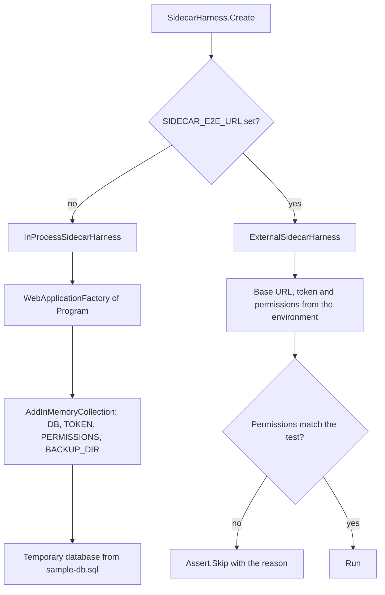

# End-to-end test harness

One test project, `test/Xakpc.SQLiteMCPSidecar.Tests`. The suite runs against the sidecar in this
process by default, and against a sidecar that already runs when three environment variables are
set. Every later phase reuses this harness, thus keep it working.

Code: `test/Xakpc.SQLiteMCPSidecar.Tests/Harness/SidecarHarness.cs`.

## Why two targets

The SQLite sandbox depends on the native SQLite build, thus a Windows developer run does not prove
the shipped behaviour. The roadmap therefore needs the functional suite against the published Linux
artifact. The external target is how a container run reuses these tests with no rewrite.



```powershell
dotnet test --solution Xakpc.SQLiteMCPSidecar.slnx     # in process

$env:SIDECAR_E2E_URL = 'http://localhost:8080'
$env:SIDECAR_E2E_TOKEN = 'dev-token'
$env:SIDECAR_E2E_PERMISSIONS = 'schema,read'
dotnet test --solution Xakpc.SQLiteMCPSidecar.slnx     # against a real process
```

**Invariant.** An external sidecar has a fixed permission set. A test that needs a different one
calls `Assert.Skip` with the reason, and it does not fail. The external target therefore reports
honestly instead of reporting a false failure.

The external target needs `SIDECAR_E2E_PERMISSIONS`, because the harness cannot learn the permission
set of a process that it did not start.

## The three skip rules, and they all live in `Create`

| The test asks for | External target | Why |
| --- | --- | --- |
| A different permission set | Skip | The process cannot be restarted. |
| Any `settings:` value | Skip | Same reason. |
| A `journalMode` other than `wal` | Skip | The journal mode is a property of the file that the sidecar already serves. |

**Lesson.** The third rule was missing, and one test guarded itself by hand while another did not.
`DiagnosticsToolTests.DiagnosticsReportsARollbackJournalDatabase` asks for `journalMode: "delete"`,
thus against a WAL container it ran and asserted a value that it never set. A rule that belongs to
the harness must live in the harness: a per-test guard covers the tests that someone remembered.

A test that needs the database file or the backup directory skips too, because
`ExternalSidecarHarness` returns `null` for `DatabasePath`, `BackupDirectory` and `Services`. The
six `BackupToolTests` file assertions are in that group. They stay skipped on purpose: exposing the
host side of the bind mount would buy a fourth environment variable and a
bind-mount-and-not-a-named-volume constraint, for assertions about file naming rather than about
native SQLite. The task result still proves that the copy ran.

## The container run in CI

`.github/workflows/ci.yml` has a second job, `container-e2e`. It builds the image, seeds a database,
starts the container and points the suite at it. This is the run that proves the shipped artifact,
because the sandbox depends on the native SQLite build.

**It is a matrix of two permission sets, and not of all eight.** `PermissionsMatch` is an exact-set
match, thus one container run only exercises the tests that ask for exactly that set:

| Set | What it proves |
| --- | --- |
| `schema,read` | The hard-boundary list through `query`, plus auth, gating and the result path. |
| `schema,read,danger-raw-write` | The hard-boundary list a second time through `execute_write_sql`, plus the DML policy. |

The remaining sets exercise .NET logic that the in-process job already runs on Linux. A matrix entry
that adds a set adds a container start for tests that the first job already covers.

**The container target shares one database across the whole run.** The in-process harness gives each
test its own file; the container has one mounted database and every test in that run works on it.
Each matrix entry therefore seeds a fresh database, and a new test that asserts an absolute row
count must not assume an untouched fixture.

**The mount needs `chmod -R 0777` in CI.** The image runs as uid 1654, which the host does not know,
and the mount must be writable also for `schema,read`. See
[../deployment/container.md](../deployment/container.md).

## Custom settings and the database path

```csharp
SidecarHarness.Create("schema,read", settings: new Dictionary<string, string?> { ["MAX_ROWS"] = "2" });
```

`Create` takes extra `SQLITE_SIDECAR_` values, thus a test proves a limit with a small bound and no
large fixture. A test value wins over the harness default. The same skip rule applies: the external
target cannot restart the process, thus a test that passes any setting is skipped there.

`harness.DatabasePath` names the file that the in-process harness built, for a test that writes to
the database as the owning application does. It is `null` on the external target, and such a test
skips itself.

## In-memory configuration, not environment variables

```csharp
webHost.ConfigureAppConfiguration((_, configuration) => configuration.AddInMemoryCollection(settings));
```

Environment variables are process-global and would collide across parallel test classes.

**Lesson.** This is also why `SidecarOptions.Load` runs on the first resolve of the singleton and not
on `builder.Configuration`. A read before `builder.Build()` cannot see the source that the test host
adds. See [../configuration/options.md](../configuration/options.md).

## The MCP client over the test transport

```csharp
new HttpClientTransport(
    new HttpClientTransportOptions
    {
        Endpoint = new Uri(httpClient.BaseAddress!, SidecarEndpoints.Mcp),
        TransportMode = HttpTransportMode.StreamableHttp,
        EnableStandaloneGetStream = false,
        AdditionalHeaders = new Dictionary<string, string> { ["Authorization"] = $"Bearer {token}" },
    },
    httpClient, loggerFactory: null, ownsHttpClient: true)
```

The `HttpClient` overload of `HttpClientTransport` is what makes the in-memory
`WebApplicationFactory` client usable as a real MCP transport. The tests therefore exercise the whole
HTTP pipeline: host filtering, authentication, authorization and the transport.

`EnableStandaloneGetStream = false`, because the transport is stateless and the GET endpoint is
unavailable.

## The sample database

`Fixtures/sample-db.sql` is an embedded resource and the one source of truth. It holds `users`,
`jobs`, `logs`, two indexes, one view, check constraints, foreign keys and a few rows.

`SampleDatabase.CreateAt(path, journalMode)` applies it. `journalMode` is `delete` for the
rollback-journal case of the startup warning test.

`SampleDatabase.CreateTemporary()` builds one in a new temporary directory with a backup directory
next to it, and `Dispose` removes the directory. A held SQLite handle on Windows can block the
delete, and a leftover temporary directory is not a test failure.

## The manual path shares the seeding

`Fixtures/DevDatabaseTests.Create` writes the sample database to the path in `SIDECAR_DEV_DB`. It is
skipped when that variable is absent. `scripts/seed-dev-db.ps1` sets that variable, runs this one
test with `dotnet test --filter-method '*DevDatabaseTests.Create'`, and creates
`build/dev/backups` next to the database.

This keeps one seeding implementation for the manual path and the automated path. The alternatives
were a second project, a database file in the repository, or a `sqlite3` prerequisite.
`/build/dev/` is in `.gitignore`: the `[Bb]in/` and `[Oo]bj/` rules cover `build/bin` and
`build/obj` only.

There are two ways to start a sidecar by hand, and both serve `http://localhost:8080` with the token
`dev-token`.

```powershell
./scripts/seed-dev-db.ps1        # one time, before the first launch
```

**Launch profiles**, for F5 in Visual Studio. One profile for each deployment shape:
`read-only (schema,read)`, `agent (schema,read,write,backup)` and
`privileged (all permissions)`. `SQLITE_SIDECAR_DB` is `../../build/dev/app.db`, which is relative
to the project directory, and that directory is the working directory and the content root.

A fourth profile, `container (schema,read)`, runs the image over the same dev database. There is no
HTTPS profile, because a reverse proxy terminates TLS and the sidecar has no HTTPS redirection.

`docker compose up --build` is the other way to reach the container, and it serves the same port and
token. See [../deployment/container.md](../deployment/container.md).

**The script**, for a permission set that no profile carries, and for a startup failure:

```powershell
./scripts/dev-sidecar.ps1 [-Permissions schema,read] [-Port 8080] [-Token dev-token] [-Fresh]
./scripts/dev-sidecar.ps1 -Permissions write     # shows the read-floor startup failure
```

`ASPNETCORE_ENVIRONMENT=Development` gives plain console logs. Outside development the sidecar logs
JSON, which is what a container log pipeline needs.

`src/Xakpc.SQLiteMCPSidecar/mcp.http` holds the manual requests, and its `@host` and `@token`
variables match both paths.

## Test classes

| File | Covers |
| --- | --- |
| `StartupTests` | The read floor, unknown names, absent token, absent or nonexistent database, backup directory, numeric ranges, the all-problems-at-one-time rule, the default read-only set, and the rollback-journal deployment that starts and serves. |
| `AuthTests` | Health without a token, `401` for an absent header and for a wrong token, the identical answer for both, and a challenge with no error description. |
| `PermissionGatingTests` | `tools/list` per permission set, the backstop rejection, the exposed tool set, and a description on each tool. |
| `SchemaToolTests` | Usable DDL, no internal `sqlite_%` objects, no row data, and no database path. |
| `SandboxBoundaryTests` | Each hard boundary through `query`: `ATTACH`, DDL, pragmas, `VACUUM INTO`, `load_extension`, writes, transaction control, more than one statement. Also that a rejection names no path and that the permission set does not weaken any of it. |
| `QueryToolTests` | TOON output, the `truncated` flag, an empty result, ordinary SQL functions, repeated column names, both truncation limits, `ResultTooLarge`, the timeout interrupt, a read while the application writes, a read against a locked database, and the absence of `query` without the `read` permission. |

**Lesson.** A tool failure arrives as a `CallToolResult` with `IsError` set, and not as a transport
exception. `CallQueryAsync` and `CallSchemaAsync` raise `McpToolFailure` for that shape, thus a test
asserts on the error code the same way for both. A test that used `Record.ExceptionAsync` against
the raw call would pass with no error at all. See [../mcp/error-model.md](../mcp/error-model.md).

A pure configuration case asserts on `SidecarConfigurationException` from `SidecarOptions.Load`. A
case that needs the filesystem or the pipeline boots a host through the harness.

## Runner

`xunit.v3` 4.x runs on Microsoft.Testing.Platform. The .NET 10 SDK no longer supports the VSTest
target, thus the project has **no** `Microsoft.NET.Test.Sdk` and no `xunit.runner.visualstudio`, and
`global.json` selects the runner:

```json
{ "test": { "runner": "Microsoft.Testing.Platform" } }
```

Command shapes change with that runner: `dotnet test --solution <file>`, and `--filter-method`
in place of `--filter`.

## Related

- [../configuration/options.md](../configuration/options.md)
- [../mcp/tool-catalog.md](../mcp/tool-catalog.md)
- [../practices.md](../practices.md)
- [../plans/mvp-roadmap.md](../plans/mvp-roadmap.md) — the required test lists
