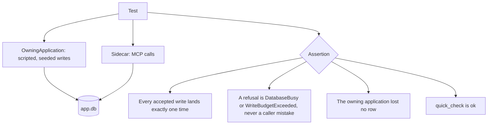

# The live-database suite

`LiveDatabaseTests` runs the sidecar against a database that a second SQLite client is using at the
same time. That is the deployment the product exists for, and every other test class works on a
quiet, private file.

Code: `test/Xakpc.SQLiteMCPSidecar.Tests/LiveDatabaseTests.cs` and
`test/Xakpc.SQLiteMCPSidecar.Tests/Harness/OwningApplication.cs`.

## The rule that makes it reproducible

**No test asserts on an interleaving.** Each one asserts something that holds for every possible
ordering, thus the result is stable although the timing is not.



A test that needs a lock conflict **holds the lock from the test**. It never hopes for a race:

```csharp
await using var held = await owner.HoldWriteLockAsync(cancellationToken);
// the sidecar write now returns DatabaseBusy, every time
```

`OwningApplication.HoldWriteLockAsync` uses `BEGIN IMMEDIATE` on a connection of its own. A deferred
`BEGIN` takes no lock until its first write, thus a test that asked for a lock would get none.

## The workload

`RunScriptedWritesAsync(operations, seed, ct)` runs a fixed number of operations and a seeded
generator chooses the mix, three inserts to one update. The row data comes from the operation index
and not from the generator, thus a test asserts on rows by name and the return value is the insert
count.

`WriteBalancedPairsAsync(pairs, ct)` writes both halves of a pair inside one transaction. A reader
that ever sees a different count of each half has read a half-written transaction, which is the whole
torn-read assertion and it needs no timing.

## What it covers

| Test | The invariant |
| --- | --- |
| `SidecarWritesSucceedWhileTheApplicationWrites` | Each accepted write lands one time; a refusal is only `DatabaseBusy` or `WriteBudgetExceeded`; the owner keeps every row; `quick_check` is ok. |
| `AWriteAgainstALockedDatabaseIsDatabaseBusy` | A held write lock gives `DatabaseBusy` and never `InvalidWrite`, and the call waited for the busy timeout. |
| `ARetryAfterDatabaseBusySucceedsAndWritesOneRow` | The retry that the message asks for works, with the same `requestId`, and writes one row. |
| `TheRequestSemaphoreSerializesAndNothingFails` | `MAX_CONCURRENCY=1` and twelve parallel reads: a queued request waits and is never refused. |
| `AQueryNeverSeesAHalfWrittenTransaction` | No torn read, over sixty reads against a continuous writer. |
| `ABackupCompletesWhileTheApplicationWrites` | A copy under load ends complete or `BackupFailed`; no partial survives; a complete copy passes `integrity_check`; the source stays sound. |

The first four close the two items that
[../plans/required-tests.md](../plans/required-tests.md) carried as having no test of their own: a
forced `SQLITE_BUSY` and a saturated request semaphore.

**WAL is enough for the lock tests.** A WAL writer does block another writer, although it does not
block a reader. Only `QueryToolTests.AQueryAgainstALockedDatabaseIsDatabaseBusy` needs a rollback
journal, because it blocks a *read*.

## In process only, and why no fourth environment variable

Every test here needs `harness.DatabasePath`, and the duplicate-key test also needs
`harness.Services`. `ExternalSidecarHarness` returns `null` for both, thus the class skips against a
container.

Reaching the container's database from the test process would need a fourth environment variable and
a bind-mount-and-not-a-named-volume constraint. [e2e-harness.md](e2e-harness.md) already weighed that
trade for the backup file assertions and refused it. The same answer holds here: contention is .NET
and SQLite locking logic, not native SQLite behaviour, and the in-process CI job runs it on Linux.

## The duplicate-`requestId` test

`ConcurrentCallsWithOneRequestIdApplyOneWrite` holds the write slot through `harness.Services`, fires
two calls with one `requestId`, releases, and asserts that one row exists. One call does the work and
the other answers `DatabaseBusy`, "already running". It then retries with the same identifier and
gets the stored answer, so the row count does not move.

**It is one-sided.** Holding the write slot parks the first call, which opens the window instead of
hoping for it, but nothing proves the second call reached `Check` while the first was still running.
It can pass while a regression is present; it cannot fail while the behaviour is correct.
`WriteDeduplicationTests.ASecondCheckBeforeTheFirstStoreDoesNotSayExecute` is the proof that needs no
timing: it calls `Check` two times. Keep both.

It was `[Fact(Explicit = true)]` while the defect was open. See
`.scratch/agent-abuse-hardening/issues/01-concurrent-requestid-applies-twice.md` and
[../security/write-controls.md](../security/write-controls.md).

## Related

- [e2e-harness.md](e2e-harness.md) — the harness and the skip rules
- [bad-agent-suite.md](bad-agent-suite.md) — the other new suite
- [../database/connections.md](../database/connections.md) — the write semaphore and the busy timeout
- [../decisions/0009-a-locked-database-is-not-a-caller-mistake.md](../decisions/0009-a-locked-database-is-not-a-caller-mistake.md)
- [../decisions/0006-backup-restart-cap.md](../decisions/0006-backup-restart-cap.md)
