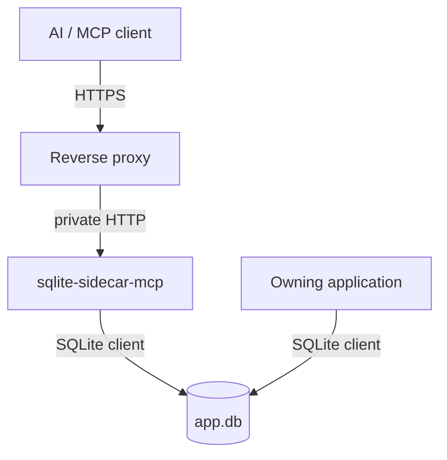
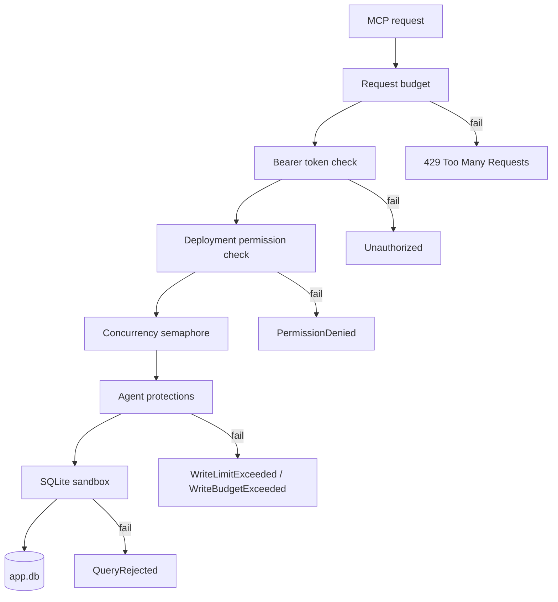

<a id="readme-top"></a>

<div align="center">

# sqlite-sidecar-mcp

**An agent-safe MCP sidecar for one live SQLite database.**

It gives an AI agent controlled access to a database that another application already owns,
and it limits the damage that an authorized but mistaken agent can cause.

[![ci][ci-shield]][ci-url]
[![license][license-shield]][license-url]
[![ghcr][ghcr-shield]][ghcr-url]
[![dotnet][dotnet-shield]][dotnet-url]

</div>

<details>
  <summary>Contents</summary>

- [About the project](#about-the-project)
- [Built with](#built-with)
- [Getting started](#getting-started)
- [The eight tools](#the-eight-tools)
- [Permissions](#permissions)
- [Configuration](#configuration)
- [Deployment](#deployment)
- [Security](#security)
- [Contributing](#contributing)
- [License](#license)
- [Contact](#contact)
- [Acknowledgments](#acknowledgments)

</details>

## About the project

An application owns a SQLite file. You want an agent to read it, and perhaps to change a few rows.
Handing the agent a SQL connection gives it the whole file and one `DELETE` with a wrong predicate
is unrecoverable. `sqlite-sidecar-mcp` sits next to that application as one more SQLite client and
speaks MCP over HTTP. The owning application does not change.



The product defends against two callers. One is an unauthorized client, which the token and the
request budget stop. The other is an **authorized client that makes a mistake**, and that one is the
unusual part: an agent with permission to write can still write the wrong thing. Structured writes,
a mandatory predicate, a row limit that counts cascades, and a per-minute write budget exist for it.

> [!IMPORTANT]
> **One sidecar process serves one database.** The request budget, the write budget and the
> idempotency cache live in process memory. A second replica gives you two independent budgets and
> two independent caches, and nothing reports it. Do not scale this service. Run a second sidecar
> only for a *different* database or a *different* trust boundary.

### Built with

- .NET 10, ASP.NET Core
- Model Context Protocol over Streamable HTTP
- `Microsoft.Data.Sqlite` with the bundled native SQLite
- [TOON](https://github.com/toon-format/toon) for row output, which costs fewer tokens than JSON

<p align="right">(<a href="#readme-top">back to top</a>)</p>

## Getting started

### Prerequisites

- Docker
- A SQLite database that **already exists**. The sidecar never creates one: creation would hide a
  wrong path and leave an empty database next to the real one.

### Run it

```bash
docker run -d --name sqlite-sidecar \
  -p 127.0.0.1:8080:8080 \
  -v /srv/myapp/data:/data \
  -e SQLITE_SIDECAR_DB=/data/app.db \
  -e SQLITE_SIDECAR_TOKEN='<a long random string>' \
  -e SQLITE_SIDECAR_PERMISSIONS=schema,read \
  --read-only --tmpfs /tmp \
  --cap-drop=ALL --security-opt=no-new-privileges \
  ghcr.io/xakpc/sqlite-mcp-sidecar:latest
```

The mount must be **writable**, also for the read-only permission set above. SQLite opens the `-shm`
file read-write for a read-only connection to a WAL database, and a read-only mount fails in a way
that reads like a permission fault rather than a configuration mistake.

### Connect an agent

The endpoint is `/db/mcp` and the token goes in an `Authorization` header:

```json
{
  "mcpServers": {
    "app-database": {
      "url": "https://example.com/db/mcp",
      "headers": { "Authorization": "Bearer <the token>" }
    }
  }
}
```

There is no OAuth. A client that insists on OAuth discovery finds no resource metadata on a `401`
and stops; the expected consumer is one agent that an operator configured with a static header.

### Generate a token and an environment block

```bash
dotnet run scripts/token.cs
```

It asks for the deployment shape, mints a token from a cryptographic random source, repairs a
permission set that would fail startup, and prints the block as `.env`, shell or compose.

<p align="right">(<a href="#readme-top">back to top</a>)</p>

## The eight tools

Which tools exist is decided by the permission set. A tool the deployment does not cover is absent
from `tools/list` — it does not appear and then fail.

| Tool | Needs | What it does |
| --- | --- | --- |
| `schema` | `schema` | Returns the DDL of the user tables, views and indexes. No row data, no internal `sqlite_%` objects, no file path. |
| `query` | `read` | Runs **one** caller-written read statement and returns rows as TOON, inside a row limit, a byte limit and a timeout. |
| `insert` | `write` | Inserts one row from a table name and a value map. The caller sends no SQL. |
| `update` | `write` | Updates rows matched by a structured filter. Needs a filter and a `maxRows`. |
| `delete` | `write` | Deletes rows matched by a structured filter. Needs a filter and a `maxRows`. |
| `backup` | `backup` | Copies the live database while the owning application keeps writing. Answers with a task; the client polls for the outcome. |
| `diagnostics` | `diagnostics` | Reports a fixed set of health values, including the journal mode and a `quick_check`. |
| `execute_write_sql` | `danger-raw-write` | Runs one caller-written `INSERT`, `UPDATE` or `DELETE`. See [Security](#security) before you enable it. |

A `query` answers in TOON, which is a compact tabular text:

```text
rows[2]{id,status}:
  54,done
  41,failed

truncated: false
```

`truncated: true` means a limit stopped the read, not that the query failed.

### Structured writes

`update` and `delete` take a flat filter, never SQL. Every condition joins with `AND`; there is no
`or` and no nesting. A disjunction is one call per branch, and that is the tighter bound: each call
is pre-counted and limited on its own, while one `or` call would pool the blast radius of every
branch into a single `maxRows`.

`maxRows` counts **every** row the write changes — rows removed by `ON DELETE CASCADE` and rows a
trigger writes included. A `delete` with `maxRows: 1` cannot quietly destroy a cascade subtree and
report one row. A filter that matches too many rows is rejected *before* the write starts, and a
write that turns out to exceed the limit is rolled back.

Every write tool takes a mandatory `requestId`. The same `requestId` returns the stored response of
a committed write instead of applying it twice. Failures are not cached, so a retry after a failure
is a real retry.

<p align="right">(<a href="#readme-top">back to top</a>)</p>

## Permissions

One deployment has one token and one permission set. A permission is a property of the deployment,
not of a user — there are no users, roles or ACLs. Separate trust levels use separate deployments,
which keeps the boundary visible in the deployment configuration.

```bash
SQLITE_SIDECAR_PERMISSIONS=schema,read      # the default
```

| Permission | Risk | What it grants |
| --- | --- | --- |
| `schema` | Low | Metadata only. |
| `read` | Sensitive | It can read all data in the database. |
| `write` | Higher | Constrained data modification in **all** tables. |
| `backup` | Sensitive | It can make database copies. |
| `diagnostics` | Low to moderate | Metadata and health values. |
| `danger-raw-write` | High | Arbitrary `INSERT`, `UPDATE` and `DELETE` SQL in all tables. |

The name `danger-raw-write` is deliberately alarming. A neutral name would hide the cost.

> [!WARNING]
> **A permission applies to every table in the database.** There is no table allowlist and no column
> allowlist. `write` does not protect one table from an agent that has `write`. If a table must stay
> untouched, it belongs in a different database with a different sidecar.

Two rules the sidecar enforces at startup, so a mistake is a failed start and not a surprise later:

- **The read floor.** `write` and `danger-raw-write` are only valid together with `schema` and
  `read`. A structured write validates names against the live schema, so an agent that cannot call
  `schema` would be guessing. The missing permissions are never added silently, because that would
  make `SQLITE_SIDECAR_PERMISSIONS` an untrue record of the deployment.
- **No unknown names.** `SQLITE_SIDECAR_PERMISSIONS=reed` fails startup instead of quietly granting
  less than the operator believes.

No permission grants another. `read` does not imply `write`, and `danger-raw-write` is independent
of `write`.

<p align="right">(<a href="#readme-top">back to top</a>)</p>

## Configuration

Every value is an environment variable with the `SQLITE_SIDECAR_` prefix. Startup fails when a value
is absent or invalid, and it reports **every** problem at once. The sidecar does not start in a
degraded state.

**Required:**

| Variable | Meaning |
| --- | --- |
| `SQLITE_SIDECAR_DB` | Path of the SQLite file. It must exist. |
| `SQLITE_SIDECAR_TOKEN` | The deployment bearer token. Supply it as a secret. |

<details>
  <summary><strong>Optional, with defaults</strong></summary>

| Variable | Default | Meaning |
| --- | --- | --- |
| `SQLITE_SIDECAR_PERMISSIONS` | `schema,read` | The permission set. |
| `SQLITE_SIDECAR_BACKUP_DIR` | none | Destination directory. Required, and must be writable, when `backup` is on. |
| `SQLITE_SIDECAR_MAX_ROWS` | `1000` | Row limit of one query result. |
| `SQLITE_SIDECAR_MAX_RESULT_BYTES` | `4194304` | Byte limit of one query result. |
| `SQLITE_SIDECAR_MAX_SQL_BYTES` | `32768` | Longest accepted statement. |
| `SQLITE_SIDECAR_QUERY_TIMEOUT_SECONDS` | `10` | A longer query is interrupted inside SQLite. |
| `SQLITE_SIDECAR_BUSY_TIMEOUT_SECONDS` | `3` | How long to wait for another writer's lock. |
| `SQLITE_SIDECAR_MAX_CONCURRENCY` | `4` | Concurrent database operations. |
| `SQLITE_SIDECAR_MAX_REQUESTS_PER_MINUTE` | `120` | The request budget, one window for the process. |
| `SQLITE_SIDECAR_MAX_WRITE_ROWS` | `100` | Server-side cap on changed rows per write. |
| `SQLITE_SIDECAR_MAX_WRITE_ROWS_PER_MINUTE` | `500` | The write budget, one window for the process. |

ASP.NET Core settings that matter: `ASPNETCORE_URLS` (the image sets `http://0.0.0.0:8080`) and
`ASPNETCORE_ENVIRONMENT`. Outside `Development` the sidecar logs JSON, which is what a container log
pipeline wants.

The effective write limit is `min(the caller's maxRows, SQLITE_SIDECAR_MAX_WRITE_ROWS)`, so an agent
can ask for less but never for more.

</details>

### Paths

| Path | Token | Rate limited |
| --- | --- | --- |
| `/db/mcp` | required | yes |
| `/health` | no | no |

`/health` reports that the process is alive and nothing else. It never touches the database: a probe
runs every few seconds, and an expensive probe would become a denial-of-service vector against the
owning application. The checks that do need the file run once, at startup.

<p align="right">(<a href="#readme-top">back to top</a>)</p>

## Deployment

> [!CAUTION]
> **The proxy must not strip the `/db` prefix.** `/db/mcp` is the whole public path: the sidecar
> routes the same URL the agent calls. Both Kamal and Coolify strip a matched prefix *by default*,
> and a stripped prefix produces a `404` that reads like a broken server. Every recipe below turns
> stripping off.

Common to all of them: **one replica**, `/data` writable even for `schema,read`, and the container
port never published to the internet — the reverse proxy is the only way in, and it is also what
matches the `Host` header. The sidecar does no host filtering of its own.

<details>
  <summary><strong>Docker Compose</strong></summary>

```yaml
services:

  app:
    image: my-app
    volumes:
      - sqlite-data:/data

  sqlite-sidecar:
    image: ghcr.io/xakpc/sqlite-mcp-sidecar:latest
    deploy:
      replicas: 1
    environment:
      SQLITE_SIDECAR_DB: /data/app.db
      SQLITE_SIDECAR_TOKEN: ${SQLITE_SIDECAR_TOKEN}
      SQLITE_SIDECAR_PERMISSIONS: schema,read,write,backup
      SQLITE_SIDECAR_BACKUP_DIR: /backups
      ASPNETCORE_URLS: http://0.0.0.0:8080
    volumes:
      - sqlite-data:/data
      - sqlite-backups:/backups
    read_only: true
    tmpfs:
      - /tmp
    cap_drop:
      - ALL
    security_opt:
      - no-new-privileges:true

volumes:
  sqlite-data:
  sqlite-backups:
```

Both containers mount the same volume. The database file must stay on a **local** filesystem: NFS
and SMB do not implement the locking SQLite needs.

</details>

<details>
  <summary><strong>Kamal</strong></summary>

One service for one database, and one host. A sidecar reads a local file, so it cannot follow a
multi-region role set: name the host that holds the database.

```yaml
service: sqlite-sidecar
image: ghcr.io/xakpc/sqlite-mcp-sidecar
servers:
  app:
    hosts: [<host that holds the database>]
    proxy:
      ssl: true
      host: <the public host name>
      path_prefix: /db
      strip_path_prefix: false
      app_port: 8080
      healthcheck:
        path: /health
volumes:
  - "<host data directory>:/data"
env:
  clear:
    SQLITE_SIDECAR_DB: /data/app.db
    SQLITE_SIDECAR_PERMISSIONS: schema,read
  secret:
    - SQLITE_SIDECAR_TOKEN
```

- `healthcheck.path` is not optional here. kamal-proxy asks for `/up` by default, and the deploy
  fails on that default.
- kamal-proxy has **no** rate limiting. It gives buffering, body-size limits and forwarded headers.
  The in-process request budget is therefore the only request limit on this platform.

</details>

<details>
  <summary><strong>Coolify</strong></summary>

Use a subdomain, not a path. Coolify generates Traefik labels for a domain path, and the
path-plus-strip-prefix combination has open defects. A subdomain costs nothing and removes the risk.
The application path stays `/db/mcp` either way.

```text
Domain            https://mcp.<domain>
Strip Prefixes    off
Health check      /health
Replicas          1
Volume            <host data directory>:/data, writable
```

Coolify runs Traefik, so a rate-limit middleware is available. It is not necessary: the in-process
budget is active on every platform.

</details>

<details>
  <summary><strong>A plain VPS, with systemd</strong></summary>

No orchestrator at all. Put the `docker run` under systemd so it survives a reboot:

```ini
# /etc/systemd/system/sqlite-sidecar.service
[Unit]
Description=sqlite-sidecar-mcp
After=docker.service
Requires=docker.service

[Service]
Restart=always
RestartSec=5
ExecStartPre=-/usr/bin/docker rm -f sqlite-sidecar
ExecStart=/usr/bin/docker run --rm --name sqlite-sidecar \
  -p 127.0.0.1:8080:8080 \
  -v /srv/myapp/data:/data \
  --env-file /etc/sqlite-sidecar.env \
  --read-only --tmpfs /tmp \
  --cap-drop=ALL --security-opt=no-new-privileges \
  ghcr.io/xakpc/sqlite-mcp-sidecar:latest
ExecStop=/usr/bin/docker stop sqlite-sidecar

[Install]
WantedBy=multi-user.target
```

`-p 127.0.0.1:8080:8080` binds to loopback, so only a proxy on the same host reaches it. Put the
token in `/etc/sqlite-sidecar.env` with mode `0600`, and point Caddy or nginx at `127.0.0.1:8080`
with the path forwarded unchanged.

</details>

<details>
  <summary><strong>Fly.io</strong></summary>

A Fly Volume attaches to exactly one machine, which suits this product: one file, one writer, one
sidecar.

```toml
app = "myapp"

[build]
  image = "ghcr.io/xakpc/sqlite-mcp-sidecar:latest"

[env]
  SQLITE_SIDECAR_DB = "/data/app.db"
  SQLITE_SIDECAR_PERMISSIONS = "schema,read"
  ASPNETCORE_URLS = "http://0.0.0.0:8080"

[[mounts]]
  source = "app_data"
  destination = "/data"

[http_service]
  internal_port = 8080
  force_https = true
  auto_stop_machines = false
  auto_start_machines = false
  min_machines_running = 1

[[http_service.checks]]
  path = "/health"
```

```bash
fly secrets set SQLITE_SIDECAR_TOKEN='<the token>'
```

> [!WARNING]
> The sidecar and the owning application must run on the **same machine**. A volume attaches to one
> machine, so two machines means two different database files, and the one-sidecar rule fails
> silently — each process would serve its own copy. Keep `auto_stop_machines = false` and do not
> scale the app.

</details>

### Token rotation

A deployment has one token. It never expires, and the sidecar accepts no second value. Rotation is a
secret change plus a restart, which stops every client at the same moment. That is accepted here: a
rotation window would need a list of valid tokens, which is a different product.

<p align="right">(<a href="#readme-top">back to top</a>)</p>

## Security

Every request passes every layer, in order. No layer is a feature flag.



### What is guaranteed

With the default configuration, these statements are true:

- Remote access needs authentication.
- Default permissions are read-only.
- `read` does not imply `write`.
- A write permission is not valid without `schema` and `read`.
- `write` does not accept caller-supplied write SQL.
- Structured `update` and `delete` need a predicate, and the predicate joins with `AND` only.
- Structured `update` and `delete` have a hard row limit, and a broad filter is rejected before the
  write starts.
- That row limit counts **every** row the write changes, so a delete cannot destroy an unbounded
  cascade subtree while reporting one row.
- A repeated write with the same `requestId` applies one time only.
- Repeated structured writes reach a rate limit.
- Raw writes need an explicitly dangerous permission.
- Raw writes cannot run DDL, `ATTACH` or native extension loading.
- A caller cannot supply a backup filesystem path.
- A complete backup file is always a complete database. A partial copy keeps a `.partial` suffix.
- Queries have a time limit, a result limit and a concurrency limit.
- The native SQLite defensive mechanisms are on.
- The database file never goes over the network.

These are concrete controls. None of them makes a network-exposed database absolutely safe.

### The SQLite sandbox

The innermost layer is always on, and **no permission disables any part of it** —
`danger-raw-write` included. It uses the native SQLite authorizer rather than inspecting SQL with
string matching, so these are rejected during statement preparation on every path:

```text
ATTACH            DDL (CREATE / ALTER / DROP)      PRAGMA
load_extension    VACUUM                           transaction control
more than one statement in one request
```

Defensive mode is on, trusted schema is off, per-connection runtime limits bound SQL length,
expression depth and VDBE operations, and a running statement is interrupted — inside SQLite, not
merely abandoned — when it passes the timeout. Connection pooling is off, because a pooled handle
would keep the authorizer and limits of the previous operation.

### What is *not* guaranteed

> [!CAUTION]
> **There is no undo.** A `delete` inside the configured limits commits, and there is no restore
> tool. The operator owns the backup strategy. The limits protect against *breadth* — how many rows
> one mistake touches. They do not protect against *wrongness*: a correct-looking write of wrong
> values is applied exactly as asked.

**`danger-raw-write` means what the name says.** When an operator enables it, the token holder can
run this:

```sql
DELETE FROM jobs;
```

That is expected behavior, not a defect. The permission deliberately removes six protections —
structured writes, the mandatory predicate, the mandatory `maxRows`, the bounded pre-count, the
total-changes bound, and server-generated SQL. It keeps exactly two: the idempotency key and the
write budget. The SQLite sandbox above is untouched, so raw writes still cannot run DDL, attach a
database, load an extension, or write to an internal `sqlite_%` object.

**A permission covers the whole database.** See [Permissions](#permissions).

**A stolen token gets exactly the capabilities of its deployment.** The sidecar limits capability
and blast radius. It cannot make an intentionally granted destructive permission harmless. There is
no expiry and no revocation list — revoking means changing the secret and restarting.

**The budgets throttle; they do not isolate.** `SQLITE_SIDECAR_MAX_REQUESTS_PER_MINUTE` is one fixed
window for the whole process, with no per-caller partition, and it runs *before* authentication — so
a flood of wrong tokens is bounded too, and a rejected request still spends a permit. One agent that
exhausts the budget stops the other. The write budget behaves the same way. Both are process memory:
a restart resets them, and two processes do not share them.

**The container port must never face the internet.** The reverse proxy is the only path in, it
terminates TLS, and it is the host gate — the sidecar itself does no host filtering.

### Reporting a vulnerability

Use GitHub's private security advisories on this repository. Please do not open a public issue for a
security report.

<p align="right">(<a href="#readme-top">back to top</a>)</p>

## Contributing

Contributions are welcome. Fork the repository, create a branch, and open a pull request.

```bash
dotnet test --solution Xakpc.SQLiteMCPSidecar.slnx    # the whole suite

pwsh ./scripts/seed-dev-db.ps1                        # one time, before the first launch
pwsh ./scripts/dev-sidecar.ps1                        # a live sidecar on port 8080
```

Security tests are mandatory, not optional. A change to a query path, a write path or the sandbox
needs a test that proves the boundary still holds — and the suite runs a second time against the
Linux container, because the sandbox depends on the native SQLite build and a developer run on
another platform does not prove the shipped behaviour.

<p align="right">(<a href="#readme-top">back to top</a>)</p>

## License

Apache-2.0. See [`LICENSE`](LICENSE).

## Contact

Pavel Osadchuk — [github.com/xakpc](https://github.com/xakpc)

Project: [github.com/xakpc/sqlite-mcp-sidecar](https://github.com/xakpc/sqlite-mcp-sidecar)

## Acknowledgments

- [Model Context Protocol](https://modelcontextprotocol.io) and the C# SDK
- [SQLite](https://sqlite.org), for the authorizer and the online backup API this is built on
- [TOON](https://github.com/toon-format/toon)
- [Best-README-Template](https://github.com/othneildrew/Best-README-Template)

<p align="right">(<a href="#readme-top">back to top</a>)</p>

[ci-shield]: https://img.shields.io/github/actions/workflow/status/xakpc/sqlite-mcp-sidecar/ci.yml?branch=master&style=for-the-badge
[ci-url]: https://github.com/xakpc/sqlite-mcp-sidecar/actions/workflows/ci.yml
[license-shield]: https://img.shields.io/badge/license-Apache--2.0-blue?style=for-the-badge
[license-url]: https://github.com/xakpc/sqlite-mcp-sidecar/blob/master/LICENSE
[ghcr-shield]: https://img.shields.io/badge/ghcr.io-sqlite--mcp--sidecar-2496ED?style=for-the-badge&logo=docker&logoColor=white
[ghcr-url]: https://github.com/xakpc/sqlite-mcp-sidecar/pkgs/container/sqlite-mcp-sidecar
[dotnet-shield]: https://img.shields.io/badge/.NET-10-512BD4?style=for-the-badge&logo=dotnet&logoColor=white
[dotnet-url]: https://dotnet.microsoft.com
