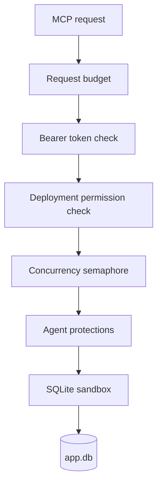

# Security policy

`sqlite-sidecar-mcp` is a security boundary between an AI agent and a live application database.
This file states what it protects against, what it deliberately does not, and how to report a
vulnerability. The same material is in the [README](README.md); this file exists so that it is also
where GitHub looks for it.

## Reporting a vulnerability

Use **GitHub private security advisories** on this repository: *Security* → *Report a
vulnerability*. Please do not open a public issue for a security report.

Include the version or image digest, the configuration that reproduces it (with the token removed),
and what an attacker or a mistaken agent gains. A first response is a best effort: this is a
personal open-source project, not a product with a support contract.

Fixes land on the default branch and in a new image tag. There is no long-term support branch.

## Supported versions

The latest published image and the default branch. Older tags receive no fixes.

## The two callers

The sidecar defends against two different callers, and the second one drives most of the design.

1. **An unauthorized client.** The bearer token stops it. The endpoint may face the public internet,
   so this caller can also be an unknown client sending a flood; the request budget bounds that.
2. **An authorized but mistaken agent.** It holds a valid token and intends no harm. It still picks
   the wrong table, writes an over-broad `WHERE`, retries a write that already committed, or asks
   for a result that empties the host's memory. The agent protections exist for this caller.

## Layers

Every request passes every layer, in order. No layer is a feature flag, and no permission turns one
off.



## What an attacker does not get

| Goal | Block |
| --- | --- |
| Read the database file over the network | The sidecar never sends the file. |
| Copy the database to a chosen path | No caller-supplied backup path. `VACUUM INTO` is rejected. |
| Reach another file on disk | `ATTACH` is rejected, and `SQLITE_LIMIT_ATTACHED` is 0. |
| Execute native code | Extension loading is never enabled. |
| Damage the schema | Defensive mode on, trusted schema off, DDL rejected. |
| Break the owning application | No `journal_mode` change, no `locking_mode` change, no DDL. |
| Exhaust host resources | Row, byte, time and concurrency limits, with `sqlite3_interrupt` for a runaway statement. |
| Fill the disk with backups | One backup at a time, plus a runaway cap on a copy that keeps restarting. |
| Exhaust process memory | The idempotency cache bounds both entry count and key length. |
| Hold a lock forever | A finite busy timeout, then `DatabaseBusy`. Never an unlimited wait. |
| Flood the endpoint | The request budget: one fixed window for the process. |
| Fill the log with rejected tokens | The budget runs **before** authentication, so a rejected request also spends a permit. |
| Guess the token | At least 32 bytes from `RandomNumberGenerator`, compared in constant time; the budget also bounds the attempt rate. |
| Turn a read session into a write session | Read connections open `ReadOnly` with `query_only=ON`. |

## Guarantees

With the default configuration, these statements are true:

- Remote access needs authentication.
- Default permissions are read-only.
- `read` does not imply `write`.
- A write permission is not valid without `schema` and `read`.
- `write` does not accept caller-supplied write SQL.
- Structured `update` and `delete` need a predicate, and the predicate joins with `AND` only.
- Structured `update` and `delete` have a hard row limit, and a broad filter is rejected before the
  write starts.
- That row limit counts **every** row the write changes, so a delete cannot destroy an unbounded
  cascade subtree while reporting one row.
- A repeated write with the same `requestId` applies one time only.
- Repeated structured writes reach a rate limit.
- Raw writes need an explicitly dangerous permission.
- Raw writes cannot run DDL, `ATTACH` or native extension loading.
- A caller cannot supply a backup filesystem path.
- A complete backup file is always a complete database. A partial copy keeps a `.partial` suffix.
- Queries have a time limit, a result limit and a concurrency limit.
- The native SQLite defensive mechanisms are on.
- The database file never goes over the network.

These are concrete controls. None of them makes a network-exposed database absolutely safe.

## Non-guarantees

Read this section before deciding how much to grant.

### There is no undo

A `delete` inside the configured limits commits, and there is no restore tool. The limits protect
against **breadth** — how many rows one mistake touches. They do not protect against **wrongness**:

```text
delete, maxRows 100, filter matches the wrong 50 rows  ->  committed, permanent
```

There is no scheduled backup and no automatic backup before a delete. The operator owns the backup
strategy.

### `danger-raw-write` removes the agent protections on purpose

When an operator enables it, the token holder can run this:

```sql
DELETE FROM jobs;
```

That is expected behavior, not a defect. The permission removes six protections and keeps two:

| Removed | Kept |
| --- | --- |
| Structured writes (server-generated SQL) | The mandatory `requestId` |
| The mandatory predicate | The per-minute write budget |
| The mandatory `maxRows` | |
| The bounded pre-count | |
| The row-limit rollback | |
| The total-changes bound | |

The SQLite sandbox is **not** weakened. A raw write still cannot run DDL, attach a database, load an
extension, run more than one statement, or write to an internal `sqlite_%` object such as
`sqlite_sequence`.

### A permission covers the whole database

There is no table allowlist and no column allowlist. `write` does not protect one table from an
agent that has `write`. A table that must stay untouched belongs in a different database behind a
different sidecar with a different token.

### A stolen token gets exactly its deployment's capabilities

The sidecar limits capability and blast radius. It cannot make an intentionally granted destructive
permission harmless. There is no expiry and no revocation list: a deployment has **one** token, it
never expires, and no second value is accepted. Rotation is a secret change plus a restart, which
disconnects every client at the same moment.

### The budgets throttle, they do not isolate

`SQLITE_SIDECAR_MAX_REQUESTS_PER_MINUTE` is one fixed window for the whole **process**, with no
per-caller partition — a partition would need `X-Forwarded-For`, which the caller controls, and an
evadable limit is worse than an honest global one. It runs before authentication, so a flood of
wrong tokens is bounded too and a rejected request still spends a permit. One agent that exhausts
the budget stops the other.

The write budget and the idempotency cache behave the same way, and both live in process memory:
a restart resets them, and **two processes do not share them**. This is why one sidecar serves one
database. Nothing in the code enforces that rule.

### The container port must never face the internet

The reverse proxy is the only path in. It terminates TLS and it is the host gate — the sidecar does
no host filtering of its own, builds no absolute URL from `Host`, and caches nothing by it. Publish
the container port to loopback or to a private network only.

### Also out of scope

- A compromised host, or a compromised owning application.
- A deliberate destructive action by a token holder that has `danger-raw-write`.
- Traffic interception when an operator serves plaintext HTTP over an untrusted network.
- A network volume attack. The request budget protects the database and the log, not the link; that
  needs a defence in front of the proxy.
- A network-mounted database file. NFS and SMB are outside the supported deployment model, because
  SQLite locking is unreliable there.

## Logging

Logs are an exfiltration path, because an agent can put content into them. The sidecar never logs:

```text
bearer tokens
returned database contents
parameter values
```

Raw SQL text is off by default, because a statement carries literal values; a raw write is logged by
the SHA-256 hash of the request instead, which correlates repeated statements while keeping no
record of the data.

Error responses carry a short code from a small fixed set. A caller never receives a stack trace, a
secret, a filesystem path, or a SQLite message that names a file — that detail goes to the log, with
the request identifier, so an operator can correlate the two.

## Hardening checklist

- Grant the smallest permission set that works. The default, `schema,read`, is read-only.
- Treat `danger-raw-write` as a decision with a blast radius, not a convenience.
- Run one replica per database.
- Keep the container port off the public internet, and let the proxy terminate TLS.
- Run the image as published: non-root, `--cap-drop=ALL`, `--security-opt=no-new-privileges`, a
  read-only root filesystem, and a small writable `tmpfs` at `/tmp`.
- Mount `/data` writable even for a read-only permission set — SQLite needs it for the `-shm` file.
- Keep the database on a local filesystem.
- Back it up. There is no undo.
